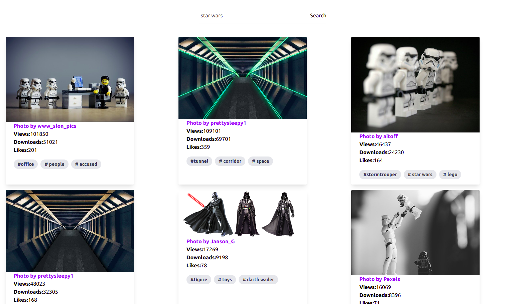

### Image Gallery React using API PIxabay 
https://image-gallery-pixabay-react.netlify.app/

Simple gallery to learn about Pixabay's API and use Tailwind css.

### Instalation

To run this project on your machine you first need to clone this repository
$ git clone https://github.com/RafaPalau/image-galery-react-tailwindcss 

### Install dependencies
npm install

### Add your Pixabay API key to .env 
 - https://pixabay.com/api/docs/

# Watch CSS & run server on :3000
npm start 

# Build CSS and assets
npm run build

